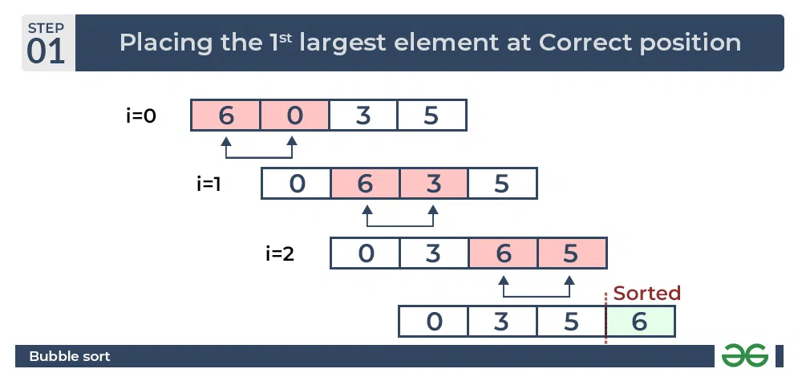

 řazení primitivních datových typů
 problematika řazení objektů

Jednoduché řadící algoritmy slouží k tomu, abychom seřadili prvky a následně mezi nimi mohli rychleji vyhledávat. Existují různé řadící algoritmy a pomocí nich jsme schopni efektivně a různě rychle řadit.

Buble sort (probublávání): Funguje na principu porovnávání dvou sousedících prvků a vždy se snaží dostat ten nejmenší doleva. Není příliš efektivní, a tak se používá spíše pro uvedení do problematiky algoritmů. Pokud je pole setřízené, tak je řadící náročnost n=1, ale největší časová náročnost je n=n$^2$. Výhoda, jednoduchý na pochopení, ale nevýhodou je vysoká časová náročnost.



``` Python

# Optimized Python program for implementation of Bubble Sort


def bubbleSort(arr):
    n = len(arr)
    
    # Traverse through all array elements
    for i in range(n):
        swapped = False

        # Last i elements are already in place
        for j in range(0, n-i-1):

            # Traverse the array from 0 to n-i-1
            # Swap if the element found is greater
            # than the next element
            if arr[j] > arr[j+1]:
                arr[j], arr[j+1] = arr[j+1], arr[j]
                swapped = True
        if (swapped == False):
            break


# Driver code to test above
if __name__ == "__main__":
    arr = [64, 34, 25, 12, 22, 11, 90]

    bubbleSort(arr)

    print("Sorted array:")
    for i in range(len(arr)):
        print("%d" % arr[i], end=" ")

# This code is modified by Suraj krushna Yadav


```

Select sort funguje na principu výběru největšího, nebo nejmenšího prvku z pole. V každém cyklu třídění proběhne n-1 porovnání, protože pokaždé se setřídí jeden prvek. Výhodou tohoto třídícího algoritmu je předem stanovený počet opakování, je jednoduchý na pochopení, ale nevýhodou je, že i když je pole setříděné, tak stále proběhnou všechna opakování. Časová náročnost je vždy n$^2$.


``` Python

# Python program for implementation of Selection
# Sort
A = [64, 25, 12, 22, 11]

# Traverse through all array elements
for i in range(len(A)-1):
    
    # Find the minimum element in remaining 
    # unsorted array
    min_idx = i
    for j in range(i+1, len(A)):
        if A[min_idx] > A[j]:
            min_idx = j
            
    # Swap the found minimum element with 
    # the first element        
    A[i], A[min_idx] = A[min_idx], A[i]

# Driver code to test above
print ("Sorted array")
for i in range(len(A)):
    print(A[i],end=" ") 


```

Insert sort, u tohoto řadící algoritmu se pole dělí na setříděný a nesetříděný úsek. Na začátku je setříděný úsek tvořen pouze prvním prvkem. Postupně se pole prochází a prvky se řadí. Nejmenší možný počet opakování n=n a největší časová náročnost je n=n$^2$.


``` Python 

# Python program for implementation of Insertion Sort

# Function to do insertion sort
def insertionSort(arr):

    # Traverse through 1 to len(arr)
    for i in range(1, len(arr)):

        key = arr[i]

        # Move elements of arr[0..i-1], that are
        # greater than key, to one position ahead
        # of their current position
        j = i-1
        while j >= 0 and key < arr[j] :
                arr[j + 1] = arr[j]
                j -= 1
        arr[j + 1] = key


# Driver code to test above
arr = [12, 11, 13, 5, 6]
insertionSort(arr)
for i in range(len(arr)):
    print ("% d" % arr[i])

# This code is contributed by Mohit Kumra


```

Programovací jazyky mají řazení často implementované, posuzují hodnoty primitivních datových typů.
Přirozené řazení: metoda *.compereTo()*, tato funkce vrací 1 jako vyšší, 0 stejně a -1 jako nižší.
Absolutní řazení: implementuje rozhraní *java.lang.Comparator*, toto rozhraní má dvě metody, první metoda je *equals()* a druhá *Integer copmare()*.

Příklad:
``` Java

// Příklad:
// Napište třídu Obchod, která bude mít vlastnosti:
// • Název
// • Podlaží
// Objekty této třídy budete chtít přirozeně řadit podle jejich:
// 1. Podlaží
// 2. Názvu
// Ve třídě s main() řazení ověřte.

class Obchod{
    private String nazev;
    private int podlazi;

    public Obchod(String nazev, int podlazi) {
        this.nazev = nazev;
        this.podlazi = podlazi;
    }

    public static int seraditPodleNazvu(Obchod o1, Obchod o2){
        return o1.nazev.compareTo(o2.nazev);
    }

    public static int seraditPodlePoctuPodlazi(Obchod o1, Obchod o2){
        return Integer.compare(o1.podlazi, o2.podlazi);
    }

    public static void main(String[] args) {
        Obchod obchod1 = new Obchod("Aobchod", 4);
        Obchod obchod2 = new Obchod("Bobchod", 3);
  
        System.out.println("razeni podle lexicografickeho poradi, vetsi 1, mensi -1, rovna se 0: " + seraditPodleNazvu(obchod1, obchod2));

        System.out.println("razeni podle lexicografickeho poradi, vetsi 1, mensi -1, rovna se 0: " + seraditPodlePoctuPodlazi(obchod1, obchod2));

    }
}

```
