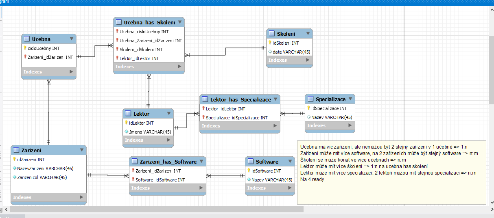

 druhy databází ✅
 pojmy relačních databází ✅
 návrh databáze, normální formy ✅
 uložení dat v databázi, indexování ✅
 NoSQL databáze ✅

Databáze je softwarový systém, který slouží pro uskladňování, správu a zpřístupňování dat. Tyto databáze mohou být použity k ukládání různých typů informací, jako jsou například záznamy o zákaznících, transakcích, produktech...

Druhy databází
- Relační databáze: Ukládají data do tabulek a používají dotazovací jazyk SQL k vyhledávání a manipulaci s daty.
- Dokumentové databáze: Ukládají data v dokumentové formě, používají JSON nebo XML. Využívají se pro aplikace, které vyžadují flexibilní a rozsáhlé ukládání dat.
- Grafové databáze: Tyto databáze se zaměřují na uskladnění a vyhledávání vztahů mezi daty.
- Klíč-hodnota databáze: Tyto databáze ukládají hodnoty jako dvojici klíče a hodnoty. Rychlé a efektivní vyhledávání dat, ale velká velikost.
- Kolonková databáze: Tyto databáze ukládají velké objemy řadových dat. Tyto databáze se často používají pro aplikace, které vyžadují efektivní analýzu velkých objemů dat.

Pojmy relačních databází:
- Tabulka: Základní jednotka relační databáze, která ukládá data jako řády řádků a sloupců. 
- Sloupec: Základní jednotka tabulky, ukládá různé typy dat, jména, data, čísla atd.
- Řádek: Základní jednotka tabulky, ukládá jednotlivé záznamy, záznamy o určitých subjektech.
- Primární klíč: Jedinečný identifikátor každého řádku, který rozlišuje jednotlivé záznamy od sebe.
- Cizí klíč: Klíč v tabulce, který odkazuje na primární klíč jiné tabulky, propojují mezi sebou jednotlivé tabulky.
- Index: struktura dat, která nám umožňuje rychle vyhledávat řádky v tabulce na základě určitého sloupce.
- Normalizace: Proces úpravy tabulek, který se používá k odstranění redundance a zlepšení integrity.
- SQL: Structured Query Language - jazyk, který slouží k manipulaci a vyhledávání v relačních databázích.

Návrh databáze:
Proces, kde se určuje, jak budou data v databázi uspořádána a jak budou propojena. Tento proces je klíčový moment pro efektivní a správné fungování databáze. Následují kroky jsou součástí procesu návrhu databáze.
- Analýza potřeb: Získávání informací o požadavcích na databázi a stanovení, jaké informace budou potřebné pro uložení.
- Identifikace entity: Určení základních jednotek, které budou uloženy v databázi, jako jsou zákazníci, produkty nebo transakce.
- Tvorba entity-relationship ER diagram: Vizualizace vztahů mezi jednotlivými entity v databázi.
- Normalizace dat: Úprava tabulek tak, aby byla eliminována redundance a zlepšena integrity dat.
- Implementace databáze: Vytvoření a implementace databáze pomocí software pro správu databází, jako je například MySQL nebo ORACLE.
- Testování a ověření: Ověření funkčnosti dat a oprava případných chyb.

Normální formy / normálové formy:
Normální formy se používají k určení stupně normalizace v relačních databázích, pomáhají odstranit redundanci dat a zlepšují integritu dat. Rozlišuje několik úrovní:
- 1NF - každé pole v tabulce obsahuje jednu hodnotu.
- 2NF - musí splňovat 1NF a zároveň pole, které není primární klíč by mělo být závislé na primárním klíči.
- 3NF - musí splňovat 1NF a 2NF, neklíčové hodnoty jsou navzájem nezávislé
- BCNF(Boyce-Coddova) - musí splňovat 1NF, 2NF a 3NF, zároveň musí být primární klíč tvořen jedním polem, hodnotou nebo skupinou polí 
- 4NF - specifické typy dat, jako jsou množiny a relace

Uložení dat v databázi:
- Relační databáze - ukládají data do tabulek a tyto tabulky jsou spojovány pomocí primárního a cizího klíče.
- Dokumentové databáze - ukládají data v podobě dokumentů, které mohou být komplexními objekty s různými poli a vnitřními strukturami, typicky objekt v JSON a pole v XML
- Databáze využívající grafy - data jsou ukládána v podobě uzlů a hran, uzel = entita/data, hrana = vztah mezi nimi.

Indexování:
Indexování slouží k rychlejšímu vyhledávání dat v databázích. Databáze obvykle ukládají data v uspořádaném seznamu, ale při hledání nechceme procházet celý seznam, a tak se vytvoří tabulka, kde se hodnoty sloupce převedou na hodnoty řádku v tabulce s daty. Tyto pozice se používají k rychlému nalezení řádků s požadovanými hodnotami, není pak potřeba procházet celou tabulku.

NoSQL - Non-relational databáze jsou typ databází, které se odlišují od relačních databází tím, že nevyžadují pevně stanovený datový model a nemají jednotný způsob ukládání dat. Tyto databáze se často používají pro ukládání velkého objemu nestrukturovaných a neformálních dat, jako jsou zprávu z sociálních médií, logovací záznamy nebo telemetrická data.

Příklad
Nakreslete ER diagram (MysqlWorkBench) popisující správu IT školicího
střediska. Bude evidovat tyto informace:
• Zařízení jednotlivých učeben (SW i HW)
• Lektorech a jejich specializacích (java-OOP, javaScript II, ...)
• Jednotlivých školení (kdy, v jaké učebně, kdo školí, obsah školení (java-
OOP, javaScript II, ...)
• Lidech přihlášených na tato školení

